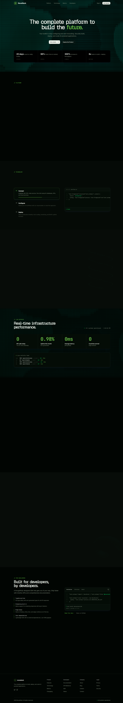

# NovaStack AI

A polished, product-first landing page for NovaStack AI. The site presents a dark, technical visual system with neon accents, strong section hierarchy, and a premium SaaS feel designed to read well on GitHub and in the browser.

[](https://nextjs.org/)
[](https://react.dev/)
[](https://www.typescriptlang.org/)
[](https://tailwindcss.com/)
[](https://www.radix-ui.com/)
[](https://vercel.com/)

## Overview

NovaStack AI is a landing page built with the Next.js App Router. The homepage flows through navigation, a bold hero, feature storytelling, a step-by-step product explanation, infrastructure proof, metrics, integrations, security, developer messaging, and a final conversion section.

## Features

- Strong hero section with clear product positioning
- Feature cards that communicate value quickly
- Step-by-step product workflow section
- Infrastructure and performance messaging
- Metrics block for trust and credibility
- Integrations and security sections for enterprise buyers
- Developer-focused section and final CTA
- Responsive layout tuned for desktop and mobile

## Homepage Preview



The image above is a full-page screenshot captured from the current production build.

## Tech Stack

- Next.js 16
- React 19
- TypeScript
- Tailwind CSS v4
- Radix UI primitives
- Lucide React icons
- React Hook Form and Zod
- Vercel Analytics

## Getting Started

Install dependencies:

```bash
pnpm install
```

Run the development server:

```bash
pnpm dev
```

Build for production:

```bash
pnpm build
```

Start the production server:

```bash
pnpm start
```

Run linting:

```bash
pnpm lint
```

## Project Structure

- `app/` - App Router pages, root layout, and global styles
- `components/landing/` - Homepage sections and marketing visuals
- `components/ui/` - Shared UI primitives
- `hooks/` - Shared React hooks
- `lib/` - Utility helpers
- `public/` - Static assets and screenshots
- `styles/` - Global stylesheet source

## Customization Guide

If you want to rebrand NovaStack AI, start here:

- `app/layout.tsx` - metadata, fonts, and app shell
- `app/page.tsx` - homepage section order
- `app/globals.css` - design tokens and color system
- `components/landing/navigation.tsx` - navigation and brand identity
- `components/landing/hero-section.tsx` - hero copy and primary CTA
- `components/landing/features-section.tsx` - product value cards
- `components/landing/how-it-works-section.tsx` - workflow explanation
- `components/landing/infrastructure-section.tsx` - infrastructure messaging
- `components/landing/metrics-section.tsx` - proof points and numbers
- `components/landing/integrations-section.tsx` - integrations content
- `components/landing/security-section.tsx` - trust and security content
- `components/landing/developers-section.tsx` - developer-focused messaging
- `components/landing/cta-section.tsx` - final conversion block
- `components/landing/footer-section.tsx` - footer links and closing copy
- `public/` - screenshots, icons, and any future marketing images

## Content Notes

- The site is currently branded as NovaStack AI.
- The screenshot in `public/readme-homepage.png` was captured from a production build on localhost.
- The layout is already sectioned for easy copy, visual, and branding updates.
- Most future changes should stay inside the landing section components rather than the page shell.

## Suggested Improvements

If you want to take the README even further, add any of the following:

- A deployment section for Vercel or another host
- Brand color tokens with hex values
- A short edit guide for content owners
- A live demo link once the site is deployed

## License

This project is ready to use as a custom landing page template. Add your preferred license before publishing publicly.
